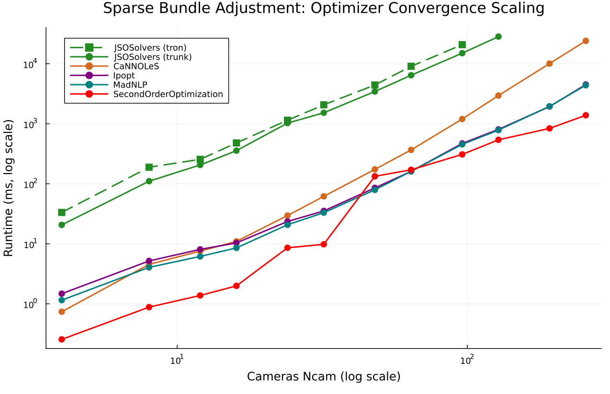
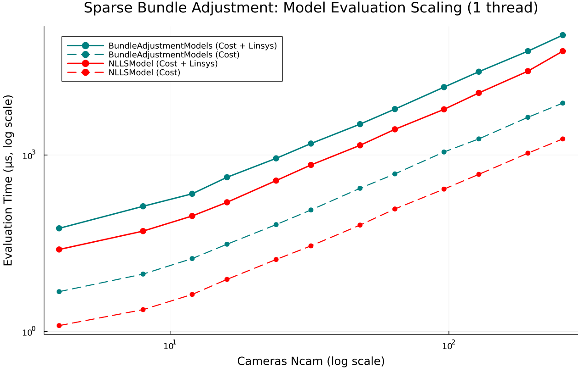

# Sparse Bundle Adjustment

- **Category**: `large_sparse`
- **Scaling Metric**: Cameras Ncam
- **Problem Sizes Evaluated**: 4, 8, 12, 16, 24, 32, 48, 64, 96, 128, 192, 256 (12 sizes)
- **Standard Baseline Model for Solvers**: `BundleAdjustmentModels`

---

## 1. Model Evaluation Scaling

The plot below shows the log-log scaling of **Pure Cost Evaluation** (dashed/dotted lines) and **Cost + Linear System Assembly** (solid/dash-dot lines) across problem sizes.

---

## 2. Optimizer Evaluation Scaling

The plot below shows the log-log scaling of **Optimizer Runtime to Convergence** across all tested solvers, where each solver is evaluated on its optimal problem representation (e.g. `NLLSModel` for `SecondOrderOptimization`, `LeastSquaresProblem` for `LeastSquaresOptim`, `NLPModels` for JSO/interior-point solvers, and `Manifolds` for `Manopt`). Non-converged runs are omitted.

---

## 3. Single-Threaded Results

The same benchmark with NLLSModel and BLAS on one thread (`set_benchmark_threads!(numthreads = 1, blas_threads = 1)`),
stored separately from the threaded table. Comparing the two shows what threading gains or costs at each size.

- [View Single-Threaded Raw Benchmark Results Data (Markdown Table)](../data/single_threaded/bundle_adjustment.md)

---

## 4. Raw Data

The full numeric benchmark measurements (cost, linear system assembly times, outer iterations, memory, and convergence status across all sizes) are persisted in the streaming Markdown data file:

- [View Full Raw Benchmark Results Data (Markdown Table)](../data/bundle_adjustment.md)

---

## 5. Analysis & Key Takeaways

- **Model Efficiency**: At Cameras Ncam = `256`, **`NLLSModel`** achieves the fastest Cost + Linear System evaluation at **16.61 ms** (88.5 MiB allocated).
- **Top Converged Optimizer**: At Cameras Ncam = `256` (4/8 solvers converged), **`SecondOrderOptimization (LM)`** is fastest at **1.56 s** (10 iterations, final cost `1.38e-20`).
- **Convergence Filtering**: Only runs satisfying universal convergence tolerances (`gtol = 1.0e-8`, `xtol = 1.0e-8`, `ftol = 1.0e-8`) within `500` iterations and `30.0s` are plotted.
