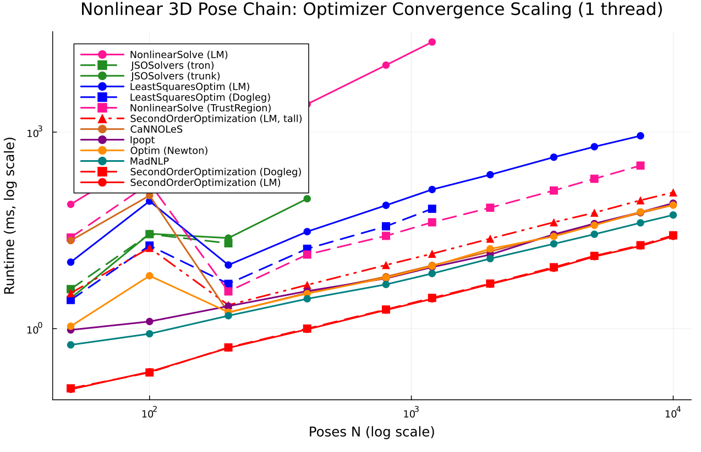

# Nonlinear 3D Pose Chain

- **Category**: `large_sparse`
- **Scaling Metric**: Poses N
- **Problem Sizes Evaluated**: 50, 100, 200, 400, 800, 1200, 2000, 3500, 5000, 7500, 10000 (11 sizes)
- **Standard Baseline Model for Solvers**: `NLLSModel (Sparse)`
- **Derivatives**: autodiff

**Derivatives: automatic.** Every cost of this problem depends on at most 8 scalar inputs, so each cost's Jacobian is computed by forward-mode automatic differentiation, with NLLSModel's `computeresjac`.

---

## The SecondOrderOptimization rows

- **`SecondOrderOptimization (Gauss-Newton)`** is `iterator = :newton` on the normal equations: Gauss–Newton, since the Hessian it is given is ``J^T J``. It takes the full step, with no line search or trust region (a diagonal shift only when the system cannot be solved), so a step that raises the cost is caught only by the stall test, and the row then ends `not_converged`. **`CaNNOLeS`** (`method = :Newton_noFHess`) is Gauss–Newton too, globalized: an ``LDL^T`` factorization of the augmented system ``[\rho I\ \ J^T;\ J\ \ {-I}]``, with ``\rho`` raised from 0 only when the factorization fails or has the wrong inertia, then an Armijo backtracking line search on ``\tfrac12\|F\|^2``.
- **`SecondOrderOptimization (LM, tall)`** is Levenberg–Marquardt on the residual-and-Jacobian form (`formulation = :jacobian`): each step solves the damped least-squares problem in ``J`` by QR, without forming ``J^T J``, on the `NLLSModel` model. `storage = :auto` stores ``J`` dense or sparse from its fill (sparse at the large sizes), and `linsolver = :auto` factorizes it by dense QR or SPQR. The rows without "tall" solve the normal equations in ``J^T J``.
- **`SecondOrderOptimization (LM, tall, LSMR)`** is the tall row with `linsolver = :lsmr`: each step's least-squares problem is solved iteratively by LSMR (Krylov.jl) instead of by QR.

---

## 1. Model Evaluation Scaling

This problem uses `NLLSModel (Sparse)` universally across all solvers via its built-in adapters; Phase 1 comparative model evaluation is omitted.

---

## 2. Optimizer Evaluation Scaling

The plot below shows the log-log scaling of **Optimizer Runtime to Convergence** across all tested solvers, where each solver is evaluated on its optimal problem representation (e.g. `NLLSModel` for `SecondOrderOptimization`, `LeastSquaresProblem` for `LeastSquaresOptim`, `NLPModels` for JSO/interior-point solvers, and `Manifolds` for `Manopt`). Non-converged runs are omitted.

---

## 3. Single-Threaded Results

The same benchmark with NLLSModel and BLAS on one thread (`set_benchmark_threads!(numthreads = 1, blas_threads = 1)`),
stored separately from the threaded table. Comparing the two shows what threading gains or costs at each size.

- [View Single-Threaded Raw Benchmark Results Data (Markdown Table)](../data/single_threaded/pose_chain.md)

---

## 4. Raw Data

The full numeric benchmark measurements (cost, linear system assembly times, outer iterations, memory, and convergence status across all sizes) are persisted in the streaming Markdown data file:

- [View Full Raw Benchmark Results Data (Markdown Table)](../data/pose_chain.md)

---

## 5. Analysis & Key Takeaways

- **Model Architecture**: Handled universally via `NLLSModel (Sparse)` with built-in zero-allocation adapters.
- **Top Converged Optimizer**: At Poses N = `10000` (9/15 solvers converged), **`SecondOrderOptimization (Gauss-Newton)`** is fastest at **27.63 ms** (5 iterations, final cost `5.44e-02`).
- **Convergence Filtering**: Only runs satisfying universal convergence tolerances (`gtol = 1.0e-8`, `xtol = 1.0e-8`, `ftol = 1.0e-8`) within `500` iterations and `30.0s` are plotted.
